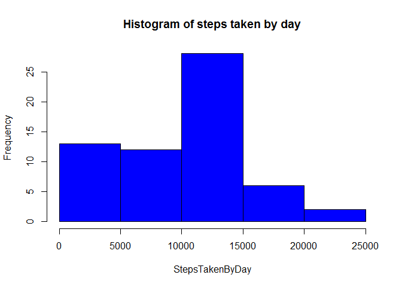
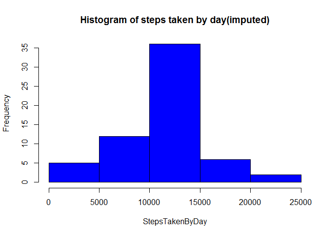
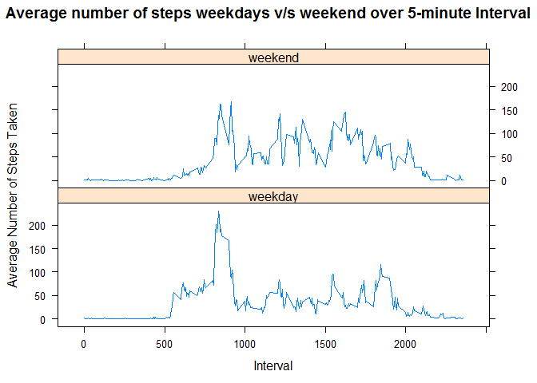

# Reproducible Research: Peer Assessment 1


## Loading and preprocessing the data
The data is in the zip file activity.zip in the repository RepData_PeerAssessment1 that is
cloned as per the assignment.


```r
setwd("~/RepData_PeerAssessment1")
unzip(zipfile="activity.zip")
activities <- read.csv("activity.csv")
```
At this point all the original data is read in activities.

## What is mean total number of steps taken per day?

```r
library(ggplot2)
#As per the assignment requiement, NA have to be ignored for calculating mean.

#Calculate the steps taken by day
StepsTakenByDay <- tapply(activities$steps, activities$date, FUN=sum, na.rm=TRUE)

#draw the histogram -- not the barplot as asked
hist(StepsTakenByDay, col="blue", main="Histogram of steps taken by day")
```

<!-- -->

```r
#Calculate and report the mean and median of the total number of steps taken per day
mean(StepsTakenByDay, na.rm = TRUE)
```

```
## [1] 9354.23
```

```r
median(StepsTakenByDay, na.rm = TRUE)
```

```
## [1] 10395
```

**Mean: 9354.23**

**Median: 10395**

## What is the average daily activity pattern?

```r
#Make a time series plot (i.e. type = "l") of the 5-minute interval (x-axis) and the average #number of steps taken, averaged across all days (y-axis)
#Which 5-minute interval, on average across all the days in the dataset, contains the maximum #number of steps?


IntAvgs <- aggregate(x=list(steps=activities$steps), by=list(interval=activities$interval),
                      FUN=mean, na.rm=TRUE)
plot(x=IntAvgs$interval, y=IntAvgs$steps, type="l", xlab="5-minute interval",
     ylab="average number of steps taken")
```

<!-- -->

```r
round(IntAvgs[which.max(IntAvgs$steps),], 0)
```

```
##     interval steps
## 104      835   206
```

**Maximum number of steps are 206 and are noted at interval 835**

## Imputing missing values

```r
#Calculate and report the total number of missing values in the dataset (i.e. the total number #of rows with NAs)
activitiesNA <- sum(is.na(activities))
activitiesNA
```

```
## [1] 2304
```

**Total number of missing values are 2304.**


```r
#Devise a strategy for filling in all of the missing values in the dataset. The strategy does #not need to be sophisticated. For example, you could use the mean/median for that day, or the #mean for that 5-minute interval, etc.


fillNAStep <- function(steps, interval) {
    
    if (!is.na(steps))
        stepsfill <- c(steps)
    else
        stepsfill <- (IntAvgs[IntAvgs$interval==interval, "steps"])
    return(stepsfill)
}
#initiliaze first
FilledActivities <- activities
FilledActivities$steps <- mapply(fillNAStep, FilledActivities$steps,FilledActivities$interval)


StepsTakenByDay <- tapply(FilledActivities$steps, FilledActivities$date, FUN=sum)

#plot the histogram to show total steps by frequency
hist(StepsTakenByDay, col="blue", main = "Histogram of steps taken by day(imputed)")
```

<!-- -->

```r
mean(StepsTakenByDay)
```

```
## [1] 10766.19
```

```r
median(StepsTakenByDay)
```

```
## [1] 10766.19
```

**Mean after imputing: 1076.19**

**Median after imputing: 1076.19**

This tells us the mean and median have balanced out after imputing; and both have shifted to
an higher values post-imputing.

## Are there differences in activity patterns between weekdays and weekends?

```r
WhatDay <- function(date) {
    dow <- weekdays(date, abbreviate = TRUE)
    if (dow %in% c("Sat", "Sun"))
       return("weekend")
    else if (dow %in% c("Mon", "Tue", "Wed", "Thu", "Fri"))
       return("weekday")
}
FilledActivities$date <- as.Date(FilledActivities$date)
FilledActivities$day <- sapply(FilledActivities$date, FUN=WhatDay)


FilledIntAvg <- aggregate(steps ~ interval + day, data=FilledActivities, mean)

library(lattice)
xyplot( steps ~ interval | day, FilledIntAvg, type = "l", layout = c(1,2),
        main = "Average number of steps weekdays v/s weekend over 5-minute Interval",
        xlab = "Interval",
        ylab = "Average Number of Steps Taken"
)
```

<!-- -->

We can see that average number of steps during the middle of the day are higher over the weekend as compared to weekdays.
